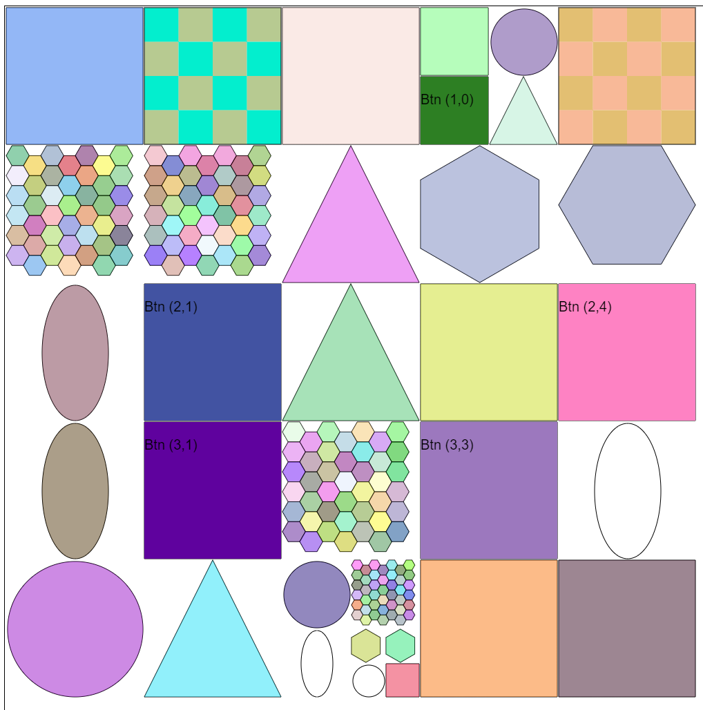
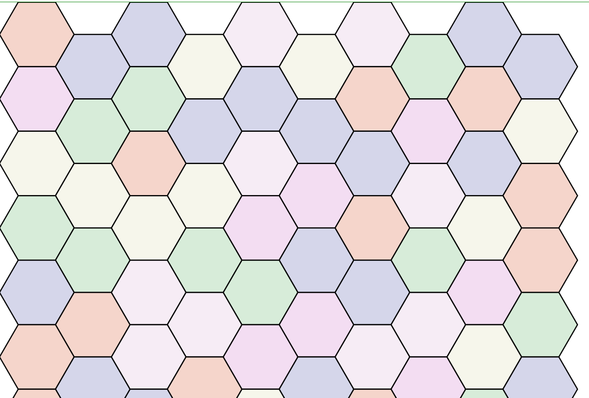

# gobs

A Graphics Library written in JavaScript

## To Run

```
npx live-server
```

## To Test

```
npm i jest-cli -g
npm i jest --save-dev
```

```
npm run test
```

## Design

This library implements a Vector shape library that could be used to create a drawing program or a masking tool.  The neat part about this library is that each component is a Web Component implemented in plain JavaScript.

The shapes currently implemented are:

1. Button
1. Checkerboard
1. Circle
1. Gob List
1. Hexagon
1. Hexgrid
1. Hyper Canvas
1. Oval
1. Point_in_polygon
1. Rectangle
1. Triangle



